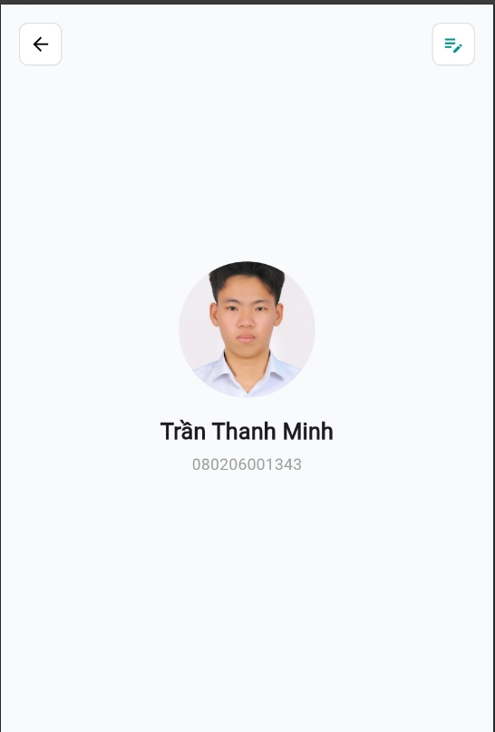

# Bài tập Tuần 1 - Lập trình di động

- **Họ tên:** Trần Thanh Minh
- **MSSV**: <080206001343>


## Câu 1: Mong muốn và định hướng sau khi học xong môn học
- Sau khi học xong môn Lập trình di động, em mong muốn nắm được những kiến thức cơ bản và quy trình để xây dựng một ứng dụng di động hoàn chỉnh.
- Em muốn biết cách thiết kế giao diện, xử lý dữ liệu, kết nối cơ sở dữ liệu và xây dựng các chức năng cho ứng dụng.
Bên cạnh kiến thức, em cũng muốn cải thiện kỹ năng tư duy lập trình và khả năng tự tìm hiểu công nghệ mới.
- Em định hướng phát triển về thiết kế hoặc lập trình game/phần mềm nào đó có thể ứng dụng được trong tương lai.
- Mục tiêu của em là có thể xây dựng được một ứng dụng thực tế từ khâu lên ý tưởng đến khi hoàn thiện.
- Sau môn học, em muốn tiếp tục thực hành và làm thêm các dự án cá nhân để nâng cao kỹ năng.
- Em cũng hy vọng bản thân mình có thể tạo ra một sản phẩm có thể triển khai và sử dụng thực tế trên điện thoại.


## Câu 2: Lập trình di động trong 10 năm tới có phát triển không?
- Có. Lập trình di động trong 10 năm tới vẫn sẽ phát triển: 
- Thứ nhất, điện thoại là thiết bị cá nhân được dùng nhiều nhất, và nhiều lĩnh vực như ngân hàng, mua sắm, giao hàng, học tập, y tế đều chạy chủ yếu trên ứng dụng di động, nhất là ở các nước đang phát triển như Việt Nam. 
- Thứ hai, phần cứng ngày càng mạnh (camera, cảm biến, chip AI), mở ra các ứng dụng mới như nhận diện hình ảnh, dịch tức thì hay thực tế tăng cường. 
- Thứ ba, ứng dụng di động còn là cầu nối điều khiển thiết bị đeo, ô tô và nhà thông minh. 
- Thứ tư, các công nghệ đa nền tảng như Flutter và React Native giúp nhóm nhỏ cũng làm được ứng dụng cho cả Android lẫn iOS, giảm chi phí và thúc đẩy nhiều sản phẩm mới. 
- Tuy nhiên, nghề sẽ thay đổi vì AI hỗ trợ viết code, nên giá trị nằm ở khả năng hiểu yêu cầu, thiết kế, kiểm tra và dùng AI hiệu quả. Vì vậy, lập trình di động vẫn có tương lai tốt với những người học liên tục và nắm vững nền tảng.

## Câu 3: Ứng dụng màn hình Profile

Ứng dụng viết bằng Flutter, gồm nút quay lại, nút chỉnh sửa, ảnh đại diện, họ tên và mã sinh viên.



### Cách chạy

```
flutter pub get
flutter run -d chrome
```